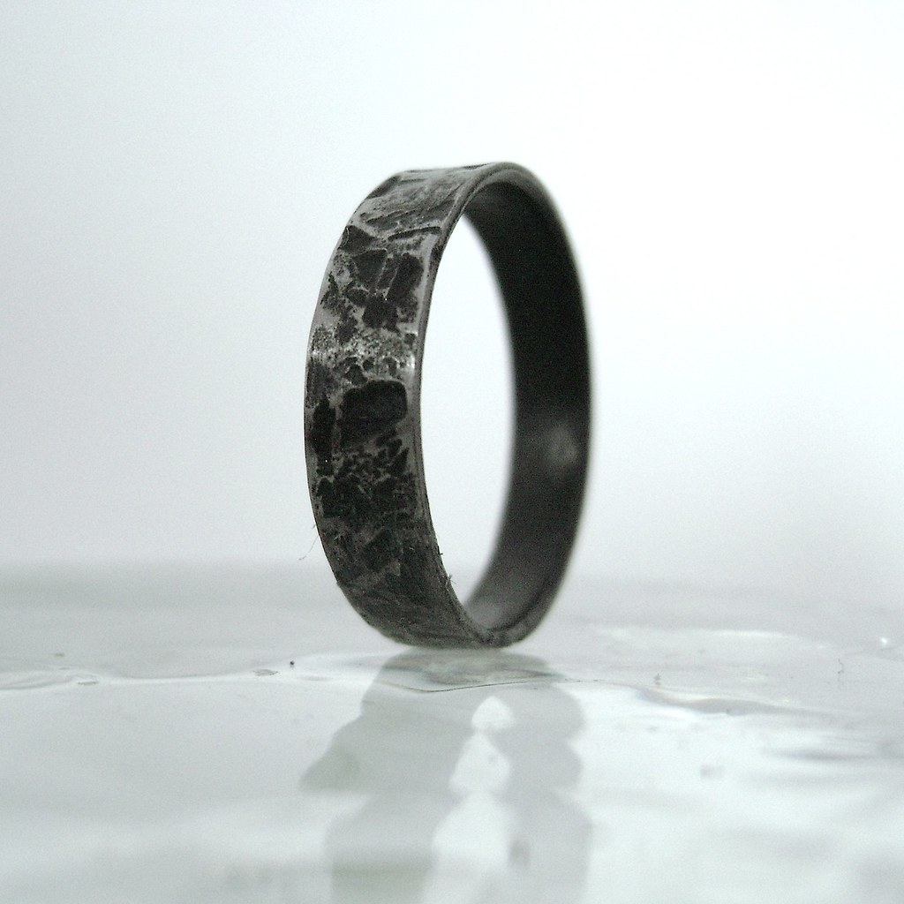

The Iron Ring project involves the manufacturing of an iron ring using lathe tools and techniques. This project showcases the skills and precision achieved in creating a finely finished iron ring with specific surface finish and dimensional requirements.

## Project Highlights

- Manufactured an iron ring using Drill Chucks, Parting Tools, and Live Centers.
- Achieved a surface finish of 0.8 micrometers.
- Maintained a dimensional tolerance of 0.1 millimeters.

## Project Details

The iron ring was crafted using lathe tools, showcasing the following techniques and achievements:

- **Tools Used:**
  - Drill Chucks
  - Parting Tools
  - Live Centers

## License

This project is licensed under the terms of the [GNU General Public License (GPL) version 3.0](LICENSE).

You can find a copy of the license in the [LICENSE](LICENSE) file included with this distribution.
